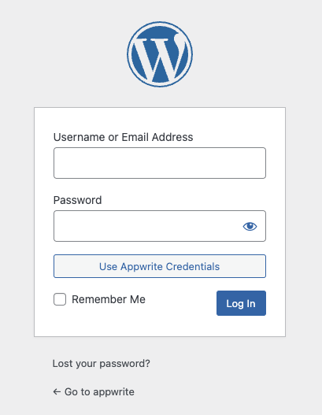
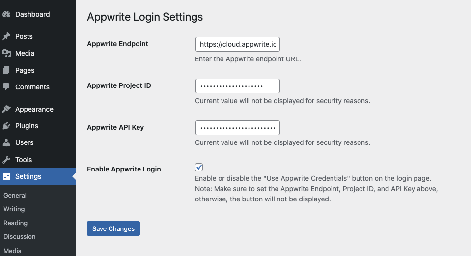
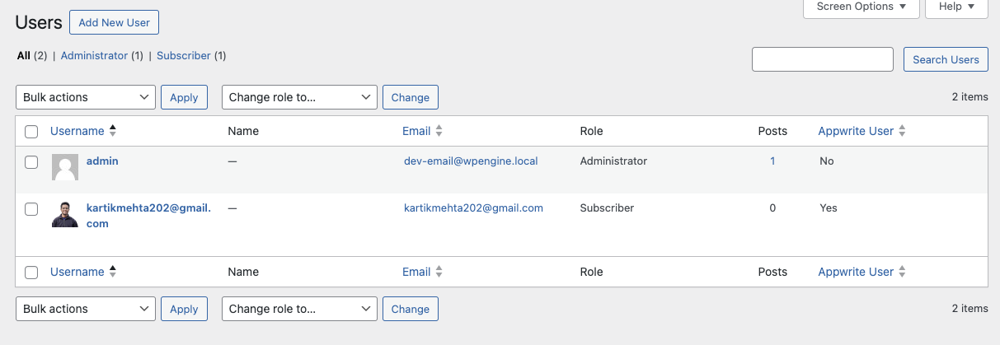

# Appwrite Login Plugin for WordPress

The **Appwrite Login Plugin** is a WordPress plugin that integrates Appwrite authentication with the WordPress login form. It allows users to log in using their Appwrite credentials and manage login settings through the WordPress admin interface.

## Features

- Adds a **"Use Appwrite Credentials"** button to the WordPress login form.
- Integrates with Appwrite user authentication, allowing users to log in via Appwrite.
- Automatically creates WordPress accounts for Appwrite users if they don't already exist.
- Disables the WordPress **"Send password reset"** link for Appwrite users, as password management is handled via Appwrite.
- Admin settings page for configuring Appwrite credentials (API Key, Project ID, and Endpoint).
- Option to enable or disable the **"Use Appwrite Credentials"** button based on settings.

## Installation

1. **Download** or **clone** this repository to your WordPress plugin directory (`/wp-content/plugins/`).
2. Run `composer install` in the plugin directory to install the Appwrite SDK dependencies.
3. Activate the plugin through the WordPress admin panel.
4. Go to **Settings** > **Appwrite Login** and configure the necessary Appwrite settings (API Key, Project ID, Endpoint).
5. Enable the **"Use Appwrite Credentials"** button by checking the **Enable Appwrite Login** option.

## Usage

### Appwrite Login Button

Once the plugin is enabled and configured:
- A **"Use Appwrite Credentials"** button will appear on the WordPress login page.
- If the user chooses to log in with Appwrite, they will be authenticated against Appwrite’s user base.
- WordPress accounts for Appwrite users will be created automatically if they don't exist.
- The WordPress login form will adjust dynamically, allowing users to toggle between WordPress and Appwrite login modes.

### Admin Settings

- **Appwrite Endpoint**: The URL of your Appwrite instance (e.g., `https://cloud.appwrite.io`).
- **Appwrite Project ID**: The Project ID from your Appwrite dashboard.
- **Appwrite API Key**: The API key with necessary permissions for authentication.
- **Enable Appwrite Login**: Enables or disables the **"Use Appwrite Credentials"** button on the login page.

### Users page for Appwrite indication

The Users page now displays whether each user is managed by Appwrite, showing "Yes" for Appwrite-managed users and "No" for regular WordPress users, based on metadata.

## Security

- The **Appwrite Project ID** and **API Key** are stored securely and are not displayed in plain text in the admin settings.
- Appwrite users' login sessions and password management are handled entirely through Appwrite.

<h3>
  

    Made with ❤️ by <a href="https://mrmehta.in">kartikmehta8</a>
  

</h3>
